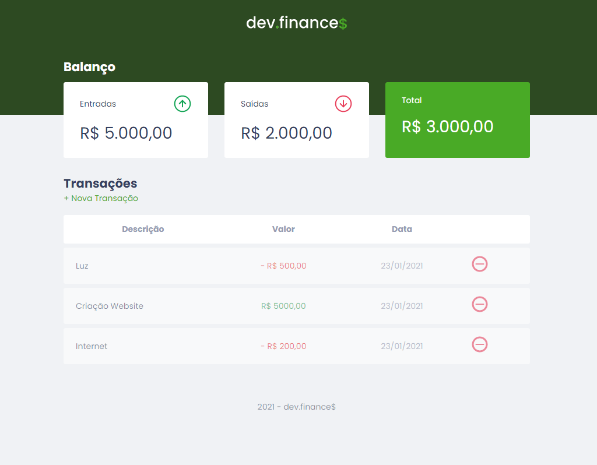
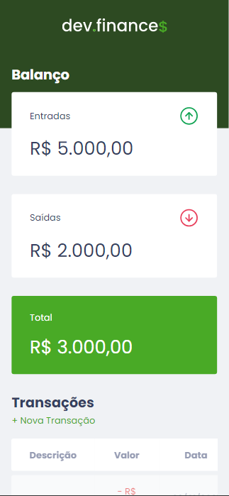
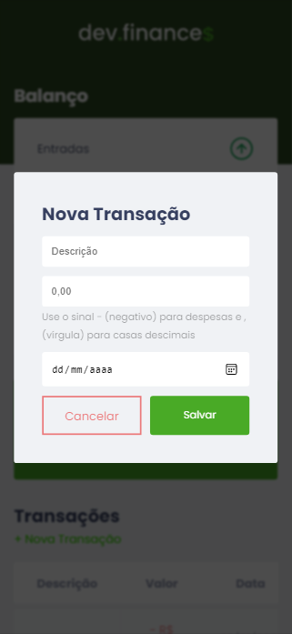

# DevFinance$ - Discovery - Rocketseat

* Projeto feito com o intuito de ter um sistema financeiro básico que mostra os Jobs feitos e seus valores, além de ter um controle de entra e saída de valores.
* O layout já está todo responsivo e funcional.

Projeto no Figma: https://www.figma.com/file/d1ryJU0RWxz1LwN5P4aqtG/dev.finance%24-Maratona-Discover-(Copy)?node-id=0%3A1

* O resultado final foi esse:

